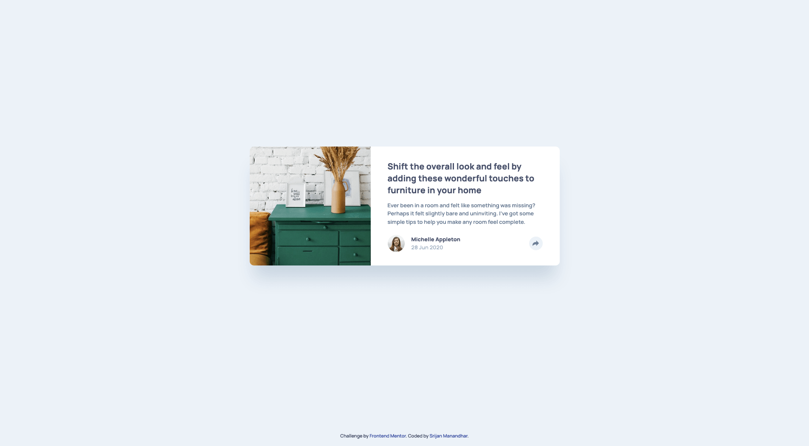

# Frontend Mentor - Article preview component solution

This is a solution to the [Article preview component challenge on Frontend Mentor](https://www.frontendmentor.io/challenges/article-preview-component-dYBN_pYFT). Frontend Mentor challenges help you improve your coding skills by building realistic projects.

## Table of contents

- [Overview](#overview)
  - [The challenge](#the-challenge)
  - [Screenshot](#screenshot)
  - [Links](#links)
- [My process](#my-process)
  - [Built with](#built-with)
  - [What I learned](#what-i-learned)
  - [Continued development](#continued-development)
- [Author](#author)

## Overview

### The challenge

Users should be able to:

- View the optimal layout for the component depending on their device's screen size
- See the social media share links when they click the share icon

### Screenshot




### Links

- Solution URL: [https://github.com/srijanss/article-preview-component](https://github.com/srijanss/article-preview-component)
- Live Site URL: [https://srijanss.github.io/article-preview-component/](https://srijanss.github.io/article-preview-component/)

## My process

### Built with

- Semantic HTML5 markup
- CSS custom properties
- Flexbox
- CSS Grid
- Mobile-first workflow
- [Vite](https://vitejs.dev/) - Lightweight frontend tooling
- [PostCSS](https://postcss.org/) - Tool to transform CSS using plugins

### What I learned

```html
<button class="card__share-btn">
  <svg
    xmlns="http://www.w3.org/2000/svg"
    width="15"
    height="13"
    role="img"
    aria-labelledby="share-svg-title"
    focusable="false"
  >
    <title id="share-svg-title">Share Icon</title>
    <path
      fill="#6E8098"
      d="M15 6.495L8.766.014V3.88H7.441C3.33 3.88 0 7.039 0 10.936v2.049l.589-.612C2.59 10.294 5.422 9.11 8.39 9.11h.375v3.867L15 6.495z"
    />
  </svg>
</button>
```

I've used svg image directly in html taking accessibility into consideration.

```css
& .card__share {
  position: relative;
  & .card__share-links {
    position: absolute;
    top: 0;
    right: 0;
    transform-origin: bottom center;
    transform: scale(0);
    transition: transform 0.05s ease-in-out;
  }
  & .card__share-btn.popover-show {
    @mixin share-btn-active;
  }
  ...;
}
```

I got to learn about the css transition, transform and transform-origin property.

```css
&:after {
  --popover-arrow-size: 12px;
  content: "";
  width: 0;
  height: 0;
  border-top: var(--popover-arrow-size) solid var(--very-dark-grayish-blue);
  border-bottom: var(--popover-arrow-size) solid transparent;
  border-right: var(--popover-arrow-size) solid transparent;
  border-left: var(--popover-arrow-size) solid transparent;
  position: absolute;
  bottom: calc(var(--popover-arrow-size) * 2 * -1);
  left: calc(50% - var(--popover-arrow-size));
}
```

I also got to learn about how to use CSS borders to create tringle shapes.

```js
const toggleShareLinksEvents = ["click", "touchstart", "keydown"];
toggleShareLinksEvents.forEach((event) => {
  cardShareBtn.addEventListener(event, (e) => {
    if (e.type === "keydown" && (e.key !== "Enter" || e.key !== " ")) {
      return;
    } else {
      e.preventDefault();
    }
    !popoverActive ? showShareLinks() : hideShareLinks();
  });
});

window.addEventListener("resize", () => {
  viewPortWidth = window.innerWidth;
  hideShareLinks();
});
```

I learned how to add event listeners and toggle share links block based on user interactions.
I've also used window.innerWidth to decide on which share links styles to use for which screens. And update the viewPortWidth variable based on window resize so that screen size is updated and corresponding share link block is shown.

### Continued development

I will focus more on CSS transition and animation properties to make the animations more subtle and professional.

## Author

- Website - [Srijan Manandhar](https://github.com/srijanss)
- Frontend Mentor - [@srijanss](https://www.frontendmentor.io/profile/srijanss)
